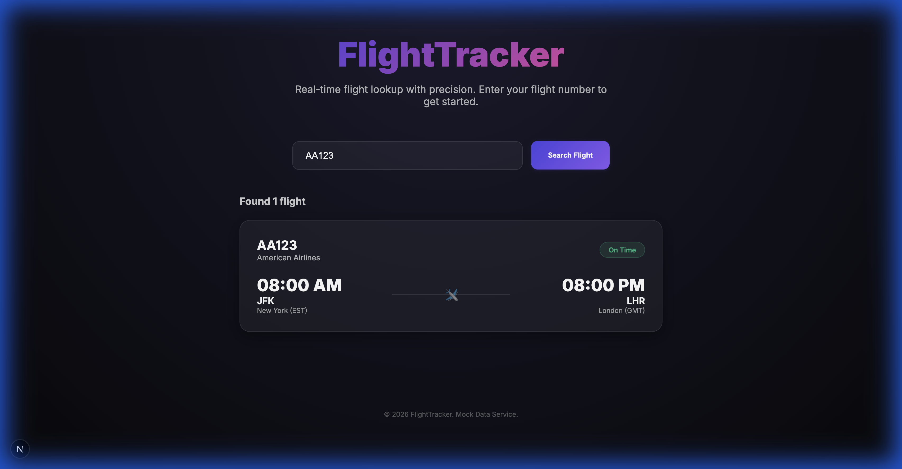
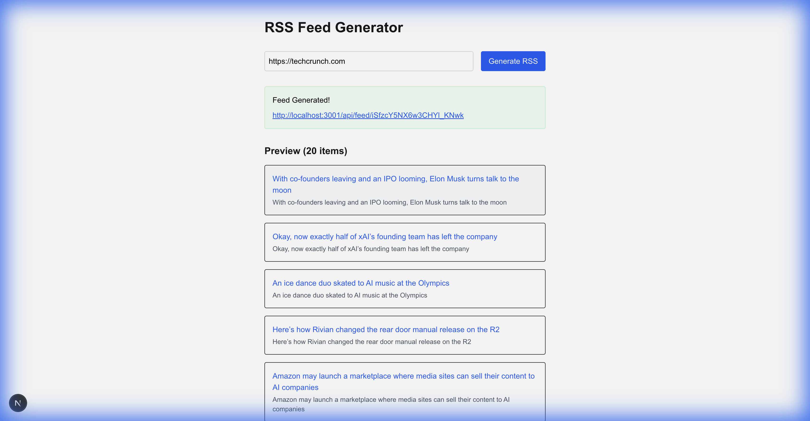

# AI Projects 🤖

This repository is a collection of projects and applications built **exclusively using AI**.

Every line of code, design decision, and documentation in this directory has been generated through collaborative pair-programming with AI agents.

## 📁 Projects

1. **[FlightTracker](./flight-lookup-app/README.md)**: A premium Next.js flight lookup web app with glassmorphism and real-time status tracking.

   

2. **[RSS App Clone](./rss-app-clone)**: A Next.js application that scrapes websites and generates RSS feeds for them.

   

   - **Tech Stack**: Next.js 15, Tailwind CSS, Cheerio, RSS
   - **Key Features**:
     - URL Scraping
     - RSS Feed Generation
     - Instant Preview
   - **Status**: MVP Complete
---

*Built with ❤️ and AI.*
