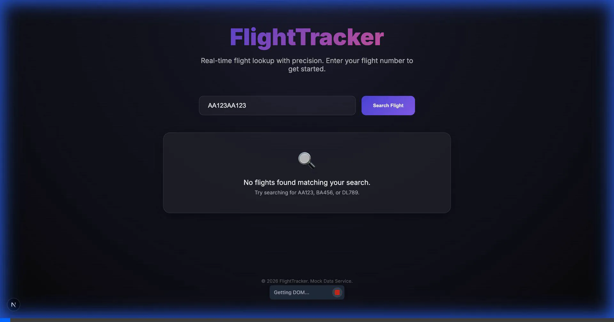

# FlightTracker ✈️

A premium, interactive Flight Lookup web application built with **Next.js**, **TypeScript**, and **Vanilla CSS**. This app provides real-time (mocked) flight details with a stunning modern aesthetic.


## ✨ Features

- **Interactive Flight Search**: Quick lookups by flight number (e.g., `AA123`, `BA456`, `DL789`).
- **Comprehensive Flight Data**: View departure/arrival times, airport locations, time zones, and live statuses.
- **Premium Design System**:
  - **Glassmorphism**: Semi-transparent, blurred UI elements for a modern feel.
  - **Dynamic Gauges & Indicators**: Clear visual status for flight states (On Time, Delayed, Cancelled).
  - **Fluid Animations**: Subtle fade-in transitions and micro-interactions.
  - **Custom Color Palette**: Deep navy and purple gradients optimized for dark mode.

## 🚀 Getting Started

### Prerequisites

- Node.js 18.x or later
- npm or yarn

### Installation

1. Clone the repository:
   ```bash
   git clone <repository-url>
   cd flight-lookup-app
   ```

2. Install dependencies:
   ```bash
   npm install
   ```

3. Run the development server:
   ```bash
   npm run dev
   ```

4. Open [http://localhost:3000](http://localhost:3000) with your browser to see the result.

## 🛠️ Tech Stack

- **Framework**: [Next.js 15+](https://nextjs.org/) (App Router)
- **Language**: [TypeScript](https://www.typescriptlang.org/)
- **Styling**: Vanilla CSS (CSS Variables + Glassmorphism)
- **Icons**: Emoji-based (Lightweight & Universal)

## 📸 Demo



## 📝 License

This project is open-source and available under the MIT License.
